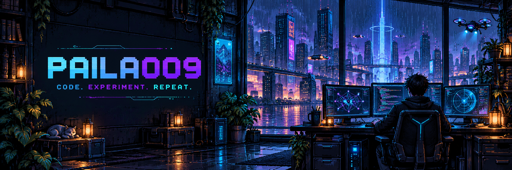
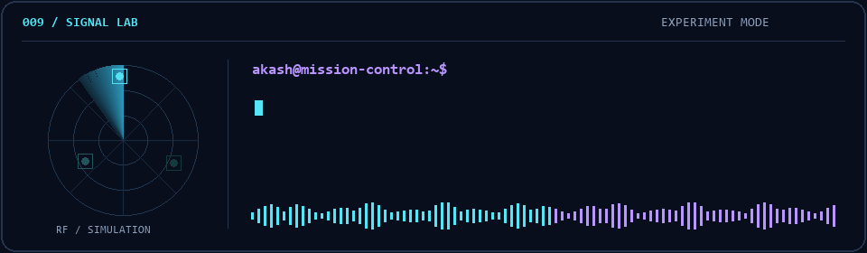
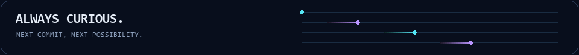

# Hey, I'm Paila Akash.

### AI experiments. Signal intelligence. Web experiences.

Computer Science & Engineering · Generative AI · K L University

<a href="https://github.com/Paila009?tab=repositories"><b>Explore my projects ↗</b></a>
&nbsp;&nbsp; · &nbsp;&nbsp;
<a href="https://www.linkedin.com/in/paila-akash"><b>LinkedIn ↗</b></a>

  

## `01` / Behind the keyboard

I'm a computer science student drawn to the space where **AI, software, and real-world signals** meet. My projects move from investigating uncertainty inside language models to visualizing RF signals and building interactive web applications.

I like making complex ideas tangible: an experiment you can reproduce, a signal you can see, or an interface you can actually use.

- **AI & research** — exploring hallucination detection, retrieval-augmented generation, and model uncertainty.
- **Signals & simulation** — experimenting with RF analysis, direction estimation, and visual dashboards.
- **Full-stack development** — building with React, Next.js, Python, and Django, with room for motion and 3D.

## `02` / Selected builds

<table>
<tr>
<td width="50%" valign="top">

### 🧠 LLM Uncertainty Lab

**Can a model reveal when it's guessing?**

A research project exploring internal uncertainty signals in RAG. Includes entropy baselines, logistic and MLP probes, reproducible evaluation, and a local evidence-aware chat dashboard. Current results are predictive; causal and cross-model experiments remain future work.

`Python` `PyTorch` `RAG` `Model evaluation`

**[Explore SOA →](https://github.com/Paila009/SOA)**

</td>
<td width="50%" valign="top">

### 📡 Drone Direction-Finding Simulator

**From invisible signals to visible patterns.**

A simulation and analysis workspace combining Python dashboards with MATLAB/Simulink models. Explore signal generation, spectrum views, recording replay, antenna arrays, and MUSIC-based direction estimation.

`Python` `PyQt6` `NumPy` `MATLAB`

**[Explore the simulator →](https://github.com/Paila009/Drone_DF_Simulator)**

</td>
</tr>
<tr>
<td width="50%" valign="top">

### 🌱 LILNEST

**Thoughtful software for everyday care.**

A maternal and child wellness application project with dashboard, medical-record, marketplace, and time-capsule modules. Combines a Next.js interface and Django backend, with interactive 3D elements and role-based user flows.

`Next.js` `React` `Django` `Three.js`

**[Explore LILNEST-BLOG →](https://github.com/Paila009/LILNEST-BLOG)**

</td>
<td width="50%" valign="top">

### 🧮 RF Algorithms & Dashboard

**The calculations behind the visualizations.**

A MATLAB/Simulink workspace for RF signal generation and processing, antenna-array modeling, direction and distance estimation, classification, and dashboard experiments.

`MATLAB` `Simulink` `Signal processing`

**[Explore the algorithms →](https://github.com/Paila009/Matlab-Dashboard-Calculations-Algorithms-)**

</td>
</tr>
<tr>
<td width="50%" valign="top">

### ✨ Interactive Portfolio

**A playground for code, motion, and personality.**

A portfolio built with Next.js and TypeScript, featuring a 3D scene, particle effects, terminal animation, a command palette, and motion experiments with GSAP and React Three Fiber.

`TypeScript` `Next.js` `Three.js` `GSAP`

**[Explore Portfolio-exp →](https://github.com/Paila009/Portfolio-exp)**

</td>
<td width="50%" valign="top">

### 🛒 E-Commerce Admin Dashboard

**A compact interface for a busy store.**

A lightweight, static admin-dashboard demo for products, orders, and customers. Uses seeded sample data and runs directly in the browser with plain HTML, CSS, and JavaScript.

`JavaScript` `HTML` `CSS`

**[Explore the dashboard →](https://github.com/Paila009/E-commerce-website)**

</td>
</tr>
</table>

## `03` / Tools I build with

**Also in the mix:** Simulink · SciPy · Matplotlib · PyQt6 · Three.js · GSAP · Git

## `04` / The next experiment

I'm interested in making AI systems easier to inspect, signal-processing tools easier to understand, and web applications more useful and expressive.

If you're exploring **AI research, signal visualization, or creative web development**, let's connect on [LinkedIn](https://www.linkedin.com/in/paila-akash).

 

Built on curiosity. Improved one experiment at a time.

