

 

**Building across AI, full-stack development, and signal intelligence.**

 

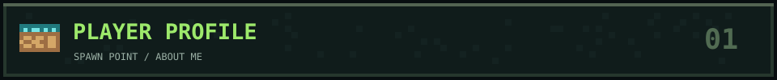

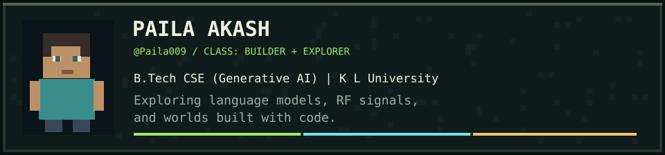

**Every good build starts with curiosity—and a few broken blocks.**

I'm **Paila Akash**, a Computer Science student connecting **AI research, signal intelligence, and creative web development**. I like making complex ideas tangible: an experiment you can reproduce, a signal you can see, or an interface you can use.

🌱 **Current quests:** LLM uncertainty and hallucination detection · RF simulation and direction finding · LILNEST · interactive 3D web experiences.

 

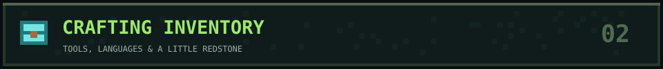

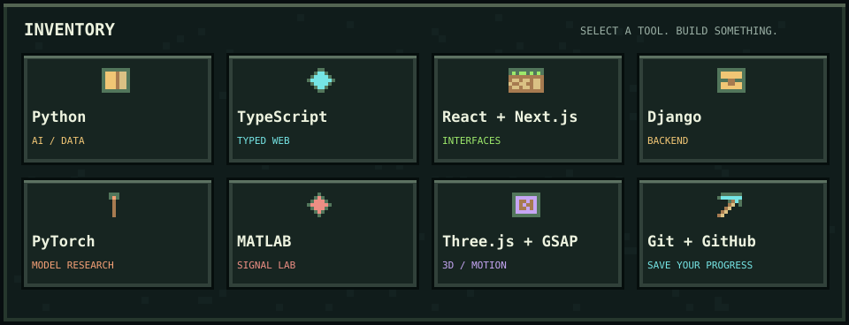

Also in the chest: NumPy · SciPy · Matplotlib · Simulink · PyQt6 · PyQtGraph · HTML · CSS

 

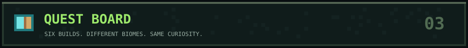

<table>

<tr>
<td width="50%" align="center"><a href="https://github.com/Paila009/SOA">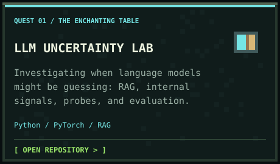</a></td>
<td width="50%" align="center"><a href="https://github.com/Paila009/Drone_DF_Simulator">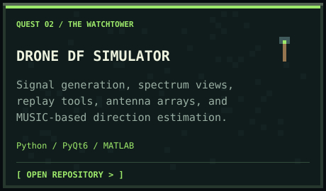</a></td>
</tr>
<tr>
<td width="50%" align="center"><a href="https://github.com/Paila009/LILNEST-BLOG">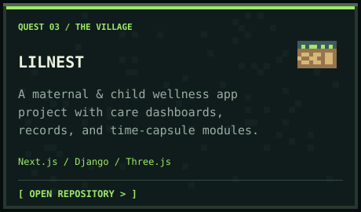</a></td>
<td width="50%" align="center"><a href="https://github.com/Paila009/Matlab-Dashboard-Calculations-Algorithms-">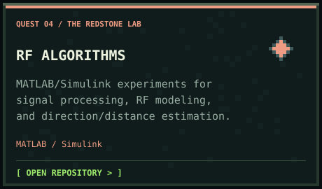</a></td>
</tr>
<tr>
<td width="50%" align="center"><a href="https://github.com/Paila009/Portfolio-exp">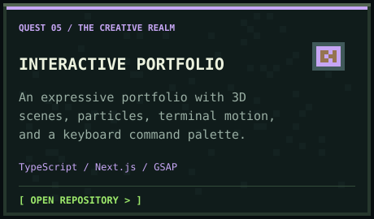</a></td>
<td width="50%" align="center"><a href="https://github.com/Paila009/E-commerce-website">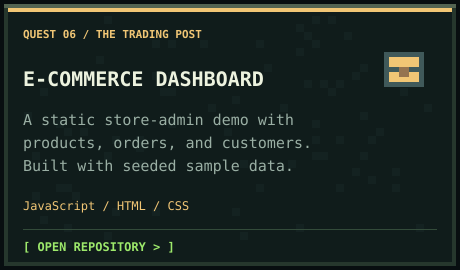</a></td>
</tr>
</table>

SOA's current results are predictive; causal validation and cross-model experiments remain future work. Project cards link directly to the code.

 

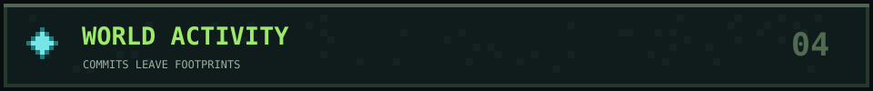

 

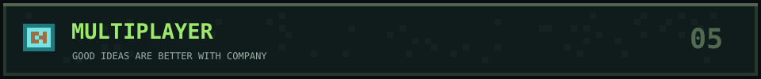

### Got a world worth building?

Let's team up on **AI experiments, signal visualization, or creative web projects**.  
Bring an idea. I'll bring curiosity and a crafting table.

  

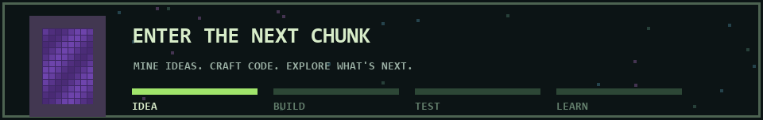

One block. One idea. One commit at a time.

📖 Open the quest journal — text version

**[Llm Uncertainty Lab](https://github.com/Paila009/SOA)** — Investigating when language models might be guessing: RAG, internal signals, probes, and evaluation.  
*Python / PyTorch / RAG*

**[Drone Df Simulator](https://github.com/Paila009/Drone_DF_Simulator)** — Signal generation, spectrum views, replay tools, antenna arrays, and MUSIC-based direction estimation.  
*Python / PyQt6 / MATLAB*

**[Lilnest](https://github.com/Paila009/LILNEST-BLOG)** — A maternal & child wellness app project with care dashboards, records, and time-capsule modules.  
*Next.js / Django / Three.js*

**[Rf Algorithms](https://github.com/Paila009/Matlab-Dashboard-Calculations-Algorithms-)** — MATLAB/Simulink experiments for signal processing, RF modeling, and direction/distance estimation.  
*MATLAB / Simulink*

**[Interactive Portfolio](https://github.com/Paila009/Portfolio-exp)** — An expressive portfolio with 3D scenes, particles, terminal motion, and a keyboard command palette.  
*TypeScript / Next.js / GSAP*

**[E-Commerce Dashboard](https://github.com/Paila009/E-commerce-website)** — A static store-admin demo with products, orders, and customers. Built with seeded sample data.  
*JavaScript / HTML / CSS*

